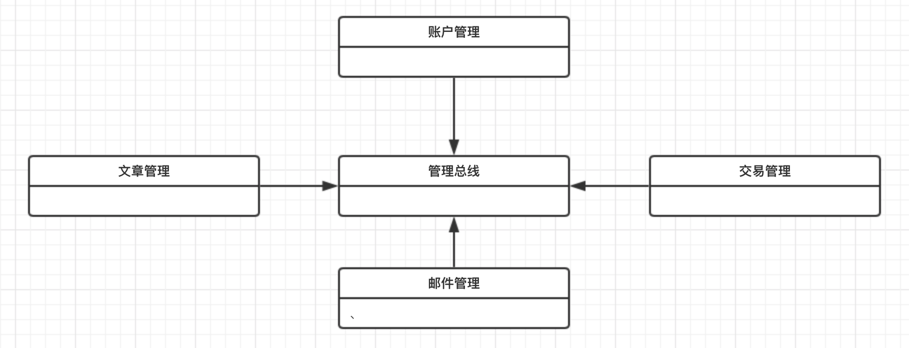

# Article.eth：智能合约的编写

作为整个 DApp 项目的基础，智能合约是整个项目中最至关重要的部分。本文详细阐述了整个智能合约的架构，以及编写和测试的过程。

## 开始之前，搭建环境

不造不必要的轮子相信已经成为项目开发时各位程序员秉承的信念。那么一个 DApp 有哪些可以让我们减少工作量的轮子可供使用呢？[Truffle](https://truffleframework.com) 或许是你不错的选择，它不仅会在你前期的合约编写中提供助力，也会让你能够非常快速高效地构建一个完整的，包含前后端的 DApp。下面我们简述如何为电脑配置好 truffle 环境，本文基于带有 HomeBrew 命令行工具的 macOS 构建，不同的操作系统和环境可能在具体命令上有所不同。

```bash
brew update && brew install node && npm install -g truffle
```

上面的命令一共做了三件事：

1. 通过 HomeBrew 更新当前安装的所有包
2. 通过 HomeBrew 安装 Nodejs 运行环境
3. 通过 Nodejs 的包管理器 npm 安装 truffle 框架的工具包

在上面的命令执行完成（国内可能需要科学上网，主要是 npm 需要进行特别的配置）之后，我们就已经配置好了 truffle 使用所需要的全部环境。接下来，我们需要创建一个工作目录来继续我们的工作：

```bash
cd ~ 
mkdir ethereum && cd ethereum
mkdir truffle && cd truffle
```

通过上面的命令，我们创建了一个路径为 `~/ethereum/truffle` 的文件夹并进入其中，其中 `~` 是用户文件夹。之后我们的开发任务都将在这个目录下进行。

## 创建 Truffle 项目及项目结构分析

然后，我们就可以在当前目录下新建一个空的 truffle 项目了（你也可以通过 unbox 命令来以模板新建项目，本次作业暂时用不到，我们就直接新建了空项目）：

```bash
truffle init
```

然后你会发现一个如下的文件目录结构：

```text
|- contracts/
|-- Migrations.sol
|- migrations/
|-- 1_initial_migration.js
|- test/
|- truffle-config.js
|- truffle.js
```

他们的作用如下：

- contracts：存放所有的合约文件的文件夹
  - Migrations.sol：确保 Truffle 的 Migrate 功能正常使用的合约
- migrations：配置 Migrate 功能的配置文件存放地
  - 1_initial_migration.js：用于初始化 Migrate 的配置文件
- tests：项目测试文件的存放地
- truffle-config.js：项目配置文件
- truffle.js：项目的 Nodejs 入口

其中，Migrate 是 Truffle 带给我们的最重要的特性之一，他可以很方便地让我们在链上部署合约，具体来讲，当我们需要新部署一系列合约时，我们只需要新建一个文件，命名格式为 序号 + 名字 + .js，然后按如下格式编写即可：

```JavaScript
var contractName = artifacts.require("./contractName.sol");

module.exports = function(deployer) {
  deployer.deploy(contractName);
};
```

关于 Migrate 更复杂的用法可以参照官网进行学习。

## Article.eth 项目介绍

### 设计理念和需求功能

Article.eth 是基于区块链构建的作家权益保护及有偿创作交易平台。我们将其设计为作家和出版商可以自由、匿名地进行作品交易、信息交换、版权认证的平台。因而我们需要提供以下功能：

- 用户账户的管理
- 用户间的邮件发送和接受
- 用户间的版权交易的创建和完成
- 作者的文章撰写和记录

### 项目结构



项目的简化结构如上图，我们将系统拆分为四个子系统来分担不同的任务，最后通过总线进行系统间通信和综合。具体到文件来说：

- AccountSystem.sol：账户管理系统
- ArticleSystem.sol：文章管理系统
- OrderSystem.sol：订单管理系统
- MailSystem.sol：邮件管理系统
- ControlBus.sol：控制总线

下面我们将分各个系统来进行讲解。

### 账户管理系统

账户管理系统负责所有用户账号的管理。在这个合约下，我们把用户划分为两类：作者和出版商。通过 `mapping`，我们使得用户可以通过自己的 address 来寻找作为作者或是出版商的用户信息（一个地址可以同时作为两种身份存在）。

在用户信息中，我们存储了一个邮件列表、一个订单列表、一个（拥有版权的）文章列表：

```Solidity
struct Account {
  address owner;
  uint articleCounter;
  uint orderCounter;
  uint mailCounter;

  mapping (uint => uint) mails;
  mapping (uint => uint) orders;
  mapping (uint => OwnedIndex) ownedArticles;
}
```

这些列表都是存储的对应实体的 index，我们将能够在控制总线中将这些 index 对应到相应的数据实体。

具体到写者和出版商，他们分别独占一个作品列表和一个创建的订单列表。实现和上面的列表大同小异：

```Solidity
struct Writer {
  Account account;
  uint writerId;
  uint articleCounter;
  mapping (uint => uint) workedArticles;
}

struct Publisher {
  Account account;
  uint publisherId;
  uint orderCounter;
  mapping (uint => uint) sentOrders;
}
```

最后，我们把用户信息组织为 mapping，方便之后的调用：

```Solidity
uint internal writerCounter = 1;
mapping (address => uint) internal writerIndex;
mapping (uint => Writer) internal writers; 

uint internal publisherCounter = 1;
mapping (address => uint) internal publisherIndex;
mapping (uint => Publisher) internal publishers;
```

为了保证数据不会被非法修改，我们令所有的 State Variables 为 internal。

同时，为了使得用户和其他合约可以操作这些数据，我们实现了各个字段的 get 或 set 方法，并且根据数据的敏感程度设置为 internal 或是 public：

```Solidity
function createWriter() public {
  require(writerIndex[msg.sender] == 0);
  writers[writerCounter] = Writer(Account(msg.sender, 0, 0, 0), writerCounter, 0);
  writerCounter++;
}
// ...
function _getWriterAt(uint index) internal view 
validWriter(index) returns(Writer) {
  return writers[index];
}
// ...
```

### 文章管理系统

文章管理系统负责处理文章数据结构及其管理。我们设计的文章数据结构如下：

```Solidity
struct Content {
  string headContent;
  bytes32 hashedContent;
  uint length;
}

struct Article {
  address writer;
  address owner;
  Content articleContent;
}
```

其中，`headContent` 是文章的开头的明文，用于向其他用户展示作者的历史作品；`hashedContent` 是文章全文经过 sha-256（在客户端发生） 和 sha-3 哈希后的算法结果，用于校验一个字符串是否是文章；`length` 是文章的长度，用于辅助校验文章。在 `Article` 中，`writer` 记录了作者的账户地址，而 `owner` 则记录版权的所有者地址。

如此设计的目的在于，在不损失其公开可查看性的前提下提供重复检查的功能。作者既可以通过头部明文展现他的创作水平，又可以通过哈希结果来隐藏全文，确保版权方利益不受损，同时还可以进行文章校验。

### 订单管理系统

订单管理系统负责订单数据结构及其管理。订单的数据结构定义如下：

```Solidity
enum State {unfinished, finished}

struct Order {
  address seller;
  address buyer;
  uint price;
  State state;
}
```

这样的数据结构使得它可以记录订单的交易双方的地址，交易的金额，以及交易的状态。但是**这并不是订单的重点**，支付操作才是订单有意义的关键。在订单管理系统中，我们实现了方法 `_finishOrder`：

```Solidity
function _finishOrder(uint index) internal {
  require(index < orderCounter);
  require(orders[index].seller == msg.sender);
  require(orders[index].state == State.unfinished);
  msg.sender.transfer(orders[index].price);
  orders[index].state = State.finished;
}
```

他会完成一个订单，并且将订单内存放的金额支付给卖家。那么这个金额要如何得来呢？我们在 `_createOrder` 中并没有存放任何金额啊！这个问题就要留到控制总线来解答了。

### 邮件管理系统

邮件系统负责邮件的数据结构及其管理。通过这个系统，我们实现了任意两个地址用户之间的通信。邮件的数据结构非常简单：

```Solidity
struct Mail {
  address sender;
  address receiver;
  string content;
}
```

同时，我们也创建了一个 mapping 来管理这些邮件：

```Solidity
uint internal mailCounter = 0;
mapping (uint => Mail) internal mails;
```

最后，我们预留了 `_sendMail` 和 `getMailContentByIndex` 以供外部调用。

### 控制总线

控制总线沟通其余的四个子系统，完成所有需要跨系统进行的操作。因而从定义上来说，他是所有四个子系统的继承：

```Solidity
contract ControlBus is ArticleSystem, AccountSystem, OrderSystem, MailSystem {
  // ...
}
```

特别的，我们来讲讲创建订单和发送邮件这两个操作。前面讲到，订单的子系统并没有实现“存款”的操作。这个操作实际上就是在数据总线中实现的，因为这要涉及到付款账户的确认：

```Solidity
function createOrder(address writer) public payable {
  _createOrder(writer, msg.value);
}
```

在这里，我们调用订单子系统的方法进行创建订单，其中，我们令订单价格为 `msg.value`，这是用户付给合约账户的钱（得益于 `payable` 的修饰符），这笔钱被临时锁在了合约中，在之后完成订单时，我们付款用到的钱也就是这部分钱。

另一个操作是发送邮件，我们实际上在这里遇到了一些困难：地址只有一个，怎样知道发给的是谁？我们解决这个问题的方法比较暴力，我们给同一地址的不同身份均发送这封邮件：

```Solidity
function writeMail(address receiver, string content) public {
  uint sendWriter = writerIndex[msg.sender];
  uint recvWriter = writerIndex[receiver];
  uint sendPublisher = publisherIndex[msg.sender];
  uint recvPublisher = publisherIndex[receiver];

  
  require(sendWriter != 0 && sendPublisher != 0);
  require(recvPublisher != 0 && recvWriter != 0);
  uint index = _sendMail(receiver, content);
  
  if (sendWriter != 0) {
    writers[sendWriter].account.mails[writers[sendWriter].account.mailCounter++]
      = index;
  }
  if (sendPublisher != 0) {
    publishers[sendPublisher].account.mails[publishers[sendPublisher].account.mailCounter++]
      = index;
  }
  
  if (recvWriter != 0) {
    writers[recvWriter].account.mails[writers[recvWriter].account.mailCounter++]
      = index;
  }
  if (recvPublisher != 0) {
    publishers[recvPublisher].account.mails[publishers[recvPublisher].account.mailCounter++]
      = index;
  }
}
```

## 合约测试

